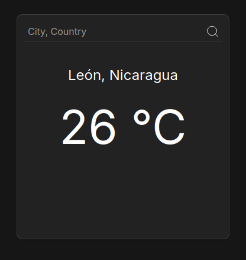

# Weather App

## Description

An extremely simple weather app as an API call exercise, this project is from the JavaScript section of [The Odin Project](https://www.theodinproject.com) course.

## Demo

  

## Resources

- [minireset.css](https://github.com/jgthms/minireset.css)
- [transfonter](https://transfonter.org/)
